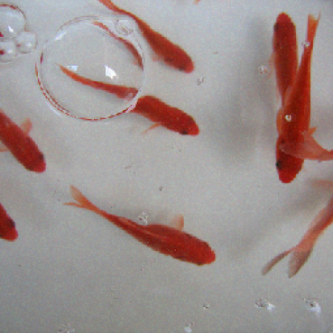
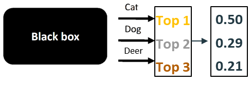
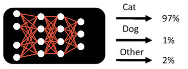
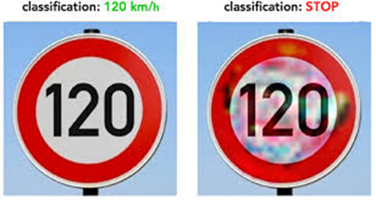
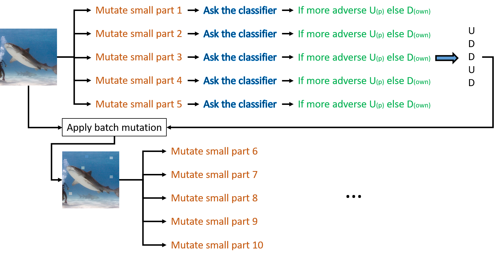
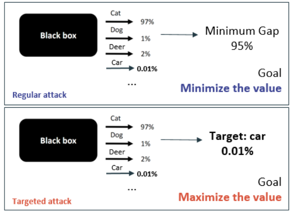
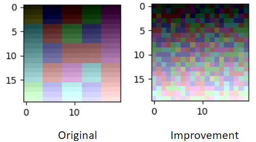
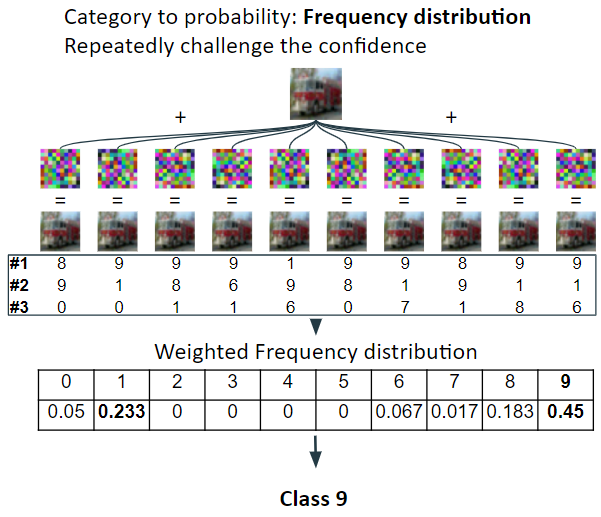
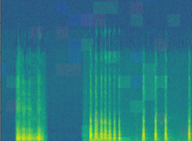
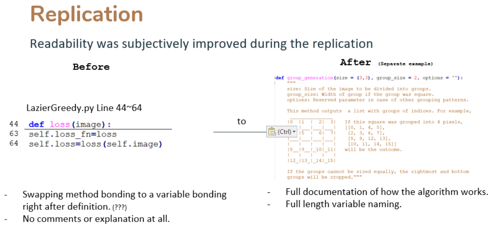

## Prerequisite 
---
Required downloads :  
- [./model_interfaces/cifar_models/model_defended/checkpoint-70000.data-00000-of-00001](https://drive.google.com/file/d/1_crLK5swgDPa-hU55ZcfwBeNjToPD3Me/view?usp=sharing)  
- [./model_interfaces/cifar_models/model_undefended/checkpoint-79000.data-00000-of-00001](https://drive.google.com/file/d/172Vy4Hcv0cAMulRal_xL6Ubb55ap7jxG/view?usp=sharing)  
- [./audios/](https://drive.google.com/drive/folders/1N5-sOO8o-82yemaRJTXKtKn6jZmBlvWM?usp=sharing)  
+The clone file size is about 200 MBs. (If the files are not available, please contact me.)  
  
Other dependencies:  
>matplotlib, tqdm, librosa, pytorch, torchvision, tensorflow=1.14  

using conda, use the following commands  
1. `conda create -n DeeperSearch`  
2. `conda activate DeeperSearch`  
3. `conda install python=3.6`  
4. `conda install matplotlib tqdm librosa`  
5. `conda install pytorch torchvision -c pytorch`  
6. `conda install tensorflow=1.14 -c conda-forge`  
7. `conda clean -a`  
After you finish experimenting, you may delete the environment now.  
7. `conda activate base`  
8. `conda env remove -n DeeperSearch`  
  
  

# DeeperSearch
In this project, we try to replicate and go further with a method by [Zhang et al.](https://dl.acm.org/doi/abs/10.1145/3368089.3409750), a simple way to generate adversarial reaction from a blackbox classifier model. 
   
As **improvements**, we experimented with:
- ### **Targeted attack**  
    The attack is required to output a certain class specified by the user.
- ### **More discreet disturbance**  
    The grouping method by Zhang et al. produces very distinctive visual artifact to the perturbed image. A simple alternative grouping method was experimented for more natural looking image outcome.  
  

- ### **Categorical feedbacked attack**  
    Classifier API are not always expected to give away all the probabilities for each classes. In this experiment setting, the classifier only outputs categories of a few most probable classes. The category output is then convert to statistical probability for the cost of proportionally more query counts.  
  
  
As **expansion**, we experimented the same concept on audio classification.
  
# Background  
- ### **Neural Network**
    A neural network can be used to classify an input to a category, and is thus used as a *classifier*. A classifier can be trained with pre-labeled dataset and used on a new data to see which class it belongs to.  
    It is called a neural network since the internal structure is mimicked from actual neural network.  
      
- ### **Adversarial Attack**
    Since the classifier (neural network) is self taught based on mathmatical model, its reasoning for the classification is not the same as how we understand the data. Because of this perception difference, the classifier will sometimes make odd classification results. This is called an adversarial output.  
    In short, adversarial attack is deliberately fooling the classifier.
    
- ### **DeepSearch**
    DeepSearch is an algorithm [Zhang et al.](https://dl.acm.org/doi/abs/10.1145/3368089.3409750) came up for simple blackbox adversarial attack.  
    To know more about how the algorithm works, watch [this video from ACM](https://www.youtube.com/watch?v=FHf0FsMXLY0&t=623s), or watch [our video](https://www.youtube.com/watch?v=mcaNGfnKA2A&t=484s) of project proposal.  
    The basic idea is to ask the classifier again and again with a slightly modified image to get closer to fooling it, building up step by step. Below is a simple graphical representation of the algorithm. Although not shown in the illustration, if adversity is achieved in any of the evaluation, the algorithm returns the image and terminates.  
    

# How to use the software
Using your command line, execute the program with python.  
`python testDeepSearch.py`  
This will run the code for imagenet attack as default. More options include:  
`python testDeepSearch.py --cifar` : Which runs the algorithm on a defended resnet classifier  
`python testDeepSearch.py --cifar --undef` : Runs the fastest attack, on an undefended resnet classifier.  
`python testDeepSearch.py --targeted 1 --target [targetnumber]` : Target number is the number of the class you want to target to. Cifar dataset has 0 to 9 values, and imagenet has 0 to 999 values.  
`python testDeepSearch.py --proba 0` : This will run the categorical attack.  
`python testDeepSearch.py --spectro` : This runs the algorithm on audio.  
  
But there are still other parameters you can and might want to change inside the testDeepSearch.py. For example,  
- In line 95, uncommenting the line will output every 'print()' into a log file.
- In line 103, you can decide how many data you want to run the attack on.
- In line 111, you can choose maximum number of query count by adjusting `max_calls` and can control the amount of information to output while the program is running by setting `verbose`.
- `distortion_cap`, `group_size`, and `batch_size` has a significant impact on performance and results. You might want to play with these parameters once you get to understand how the code works.

# Methods
- ### **Targeted Attack**  
      
    The algorithm use a scoring to decide to which direction the modification should be made. For regular attack, this scoring looked for the smallest probability gap against the original class, meaning the target changed per each loop for fastest result.  
    This was replaced by fixed probability of our targeted class.  
- ### **Improved Grouping**  
      
    Zhang et al. used square grouping pattern in order to exploit image locality for better performance. But this decision causes very unnatural patterns to appear on the image. We changed the pattern to random so the modification we make can be disguised as white noise.  
- ### **Categorical Feedbacked Attack**
        
    In categorical feedback attack, a new way to assess classification confidence was needed. The basic idea is to use statistics. Bunch of small random noise pattern was added to the original image to challenge the confidence of the classification. This give us various outputs because of the disturbance, and the statistics of the output can be processed for confidence assessment.  
    This greatly increases the query count and reduces accuracy, but can still be useful setting for a realistic blackbox attack.  
- ### **Audio Attack**  
      
    For audio, we converted audio into 2 dimensional array with fourier transform and performed Deep Search on the 2 d array and inverse transformed it back to audio.  
    It should be also possible to run the mutation with audio PCM data, which is 1 dimensional array of air pressure changes. This kind of implementation however, was not done in this project.

# Code breakdown
The code can be broken down to 4 parts: The interface (for the classifier and for the user), mutation, evaluataion, and deepSearch.  
- The interfaces ("`testDeepSearch.py`", "`***Wrappers.py`") are used to execute the algorithm with desired parameters or access the classifier models.  
- The `mutation.py` is where the group is divided and the image is modified.  
- The `evaluation.py` is where different scoring shceme of modified image is implemented. Score is evaluated to images to determine which direction (U/D) the image should be modified in order to get closer to adversity.  
- The `deepSearch.py` is essentially outer conditional loop that uses `mutation.py` and `evaluation.py` until it reaches adversity.  
  
For more detail of how the code works, please read the documentation within the code.

# Results and Conclusions of the project
### Improvement in replication

### Image/Audio Results
The resulting image for each experiments can be seen in the `./Results/` directory. Each experiments are coded:  
T - Targeted | NT - Non-targeted | C - Categorical | Pr - Probabilistic | D - Defended | UD - Undefended  

### Statistical Analysis
Here are some statistical data of the experiments:  
- Replication of Zhang et al.:  
  
- Targeted Attack:  
  
- Improved Grouping:  
  
- Categorical Feedbacked Attack:
3 out of 50 images of Cifar succeded with avg count of 5,617.  

### Conclusion
In this work we have proposed several ways of how to improve baseline algorithm DeepSearch for adversarial blackbox attacks. We have found that the algorithm  can be effectively applied on targeted attacks and audio domain. We have also observed that categorical attacks might not be successful in query usage. Finally, the random grouping is effective in reducing artifacts, but the quality of the images was reduced.  
The main restriction factor of this project has been the massive time complexity and limited computational power. More efficient classifier models and better computational power can be used for more accurate result derivation.  

## References
---
### [Original code](https://github.com/Practical-Formal-Methods/DeepSearch)
### [Original paper](https://arxiv.org/pdf/1910.06296.pdf)
